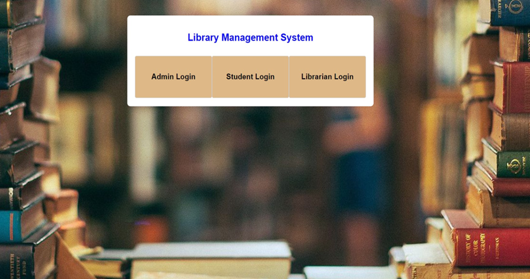
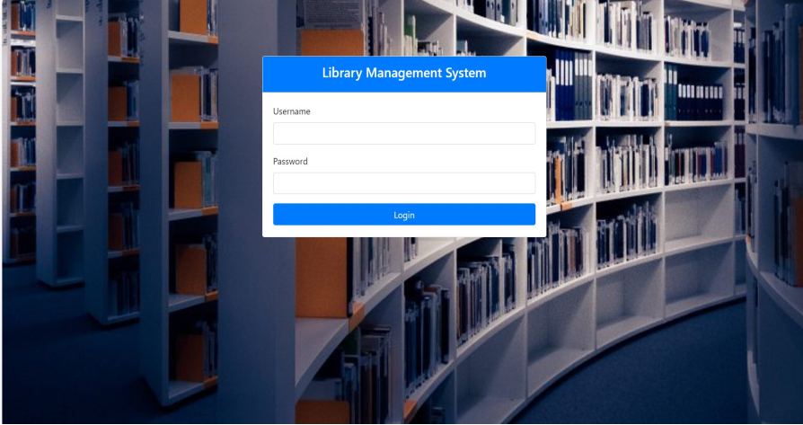
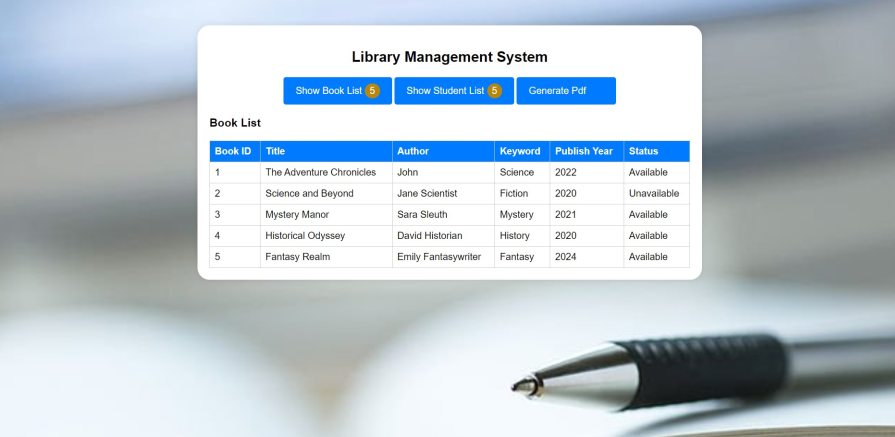
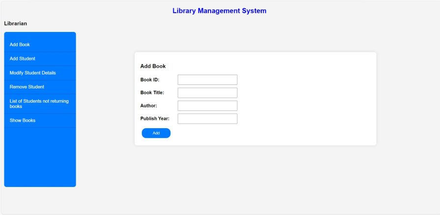
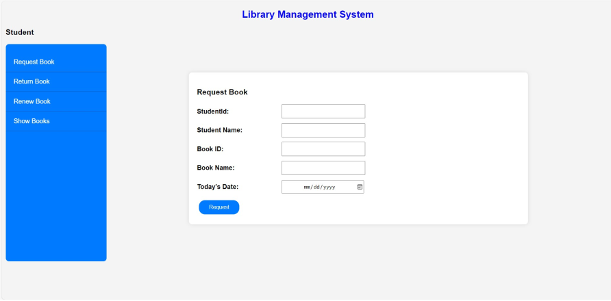

# Library Management System - Frontend
 
## Introduction
 
Welcome to the frontend documentation for the Library Management System. This document provides a comprehensive overview of the user interface components, layouts, functionalities, and interactions implemented in the frontend part of the system.It also facilitates seamless navigation, efficient information retrieval, and smooth interaction with the system's features and functionalities.

## Features

- User-friendly interface for managing library resources.
- Intuitive navigation and search functionalities.

 
## Technology Stack
 
The frontend of the Library Management System uses modern web technologies, including:
 
- HTML5
- CSS3
- JavaScript
  
## User Interface Components
 
The Library Management System frontend includes various UI components such as forms, tables, buttons, and navigation bars. These components are designed to provide a user-friendly experience and efficient navigation through the system.
 
## Download
 
Library Management System FrontEnd: [Download here](https://github.com/Karthika3009/LibraryManagementFrontend)

## Running the project

To run the Library Management System frontend locally:
   1. Clone the repository: `git clone https://github.com/Karthika3009/LibraryManagementFrontend.git`
   2. Navigate to the project directory: `cd Frontend`
   3. Open `index.html` in your web browser.
   
 
## Pages and Layouts
 
The frontend consists of multiple pages and layouts, including:
 
- Home Page
 

 
 
- Admin/Librarian/Student Login Page
 

 
- Admin Page
 

 
 
- Librarian Page
 

- Student Page

 
 
Each page has a distinct layout structure and content placement, optimized for usability and readability.
 
## Styling and Theming
 
The frontend is styled using CSS3, prioritizing clean and modern design principles. A cohesive color scheme, typography, and visual elements contribute to a sleek and visually pleasing UI.
  
## Conclusion
 
This frontend documentation offers a thorough insight into the user interface components, layouts, functionalities, and interactions of the Library Management System frontend. It acts as a valuable resource for developers, designers, and stakeholders engaged in the frontend development process.
